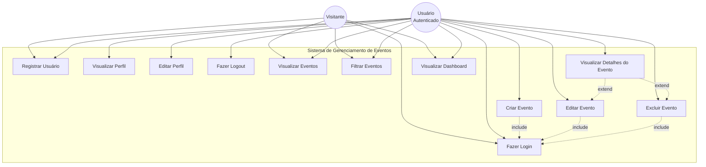

# Diagrama de Caso de Uso - Sistema de Gerenciamento de Eventos

## Descrição dos Casos de Uso

### Atores
- **Visitante**: Usuário não autenticado que pode visualizar informações públicas
- **Usuário Autenticado**: Usuário logado com permissões completas de gerenciamento

### Casos de Uso Principais

#### 1. Fazer Login (UC1)
- **Ator**: Visitante, Usuário Autenticado
- **Descrição**: Permite ao usuário autenticar-se no sistema usando email e senha
- **Pré-condições**: Usuário deve estar cadastrado
- **Pós-condições**: Usuário autenticado e redirecionado para dashboard
- **Fluxo Principal**:
  1. Usuário acessa a tela de login
  2. Insere email e senha
  3. Sistema valida credenciais
  4. Sistema gera token JWT
  5. Usuário é redirecionado para dashboard

#### 2. Registrar Usuário (UC2)
- **Ator**: Visitante
- **Descrição**: Permite criar nova conta no sistema
- **Pré-condições**: Email não pode estar cadastrado
- **Pós-condições**: Novo usuário criado e autenticado automaticamente
- **Fluxo Principal**:
  1. Usuário acessa formulário de registro
  2. Preenche nome completo, email, senha e confirmação
  3. Sistema valida dados (formato email, força da senha)
  4. Sistema cria conta com senha criptografada
  5. Sistema realiza login automático

#### 3. Visualizar Perfil (UC3)
- **Ator**: Usuário Autenticado
- **Descrição**: Exibe dados do perfil do usuário logado
- **Pré-condições**: Usuário autenticado
- **Pós-condições**: Informações do perfil exibidas

#### 4. Editar Perfil (UC4)
- **Ator**: Usuário Autenticado
- **Descrição**: Permite atualizar informações do perfil
- **Pré-condições**: Usuário autenticado
- **Pós-condições**: Dados atualizados no banco de dados
- **Fluxo Principal**:
  1. Usuário acessa seu perfil
  2. Clica em "Editar Perfil"
  3. Modifica nome completo
  4. Sistema valida e salva alterações

#### 5. Fazer Logout (UC5)
- **Ator**: Usuário Autenticado
- **Descrição**: Encerra sessão do usuário
- **Pré-condições**: Usuário autenticado
- **Pós-condições**: Token removido, usuário deslogado
- **Fluxo Principal**:
  1. Usuário clica em "Sair"
  2. Sistema remove token do localStorage
  3. Usuário redirecionado para login

#### 6. Visualizar Eventos (UC6)
- **Ator**: Visitante, Usuário Autenticado
- **Descrição**: Lista todos os eventos cadastrados
- **Pré-condições**: Nenhuma
- **Pós-condições**: Lista de eventos exibida com cards
- **Fluxo Principal**:
  1. Sistema busca eventos no banco de dados
  2. Exibe eventos em grid de cards
  3. Diferencia eventos ativos e passados visualmente

#### 7. Filtrar Eventos (UC7)
- **Ator**: Visitante, Usuário Autenticado
- **Descrição**: Busca eventos por critérios específicos
- **Pré-condições**: Nenhuma
- **Pós-condições**: Lista filtrada exibida
- **Fluxo Principal**:
  1. Usuário preenche filtros (título, local, datas)
  2. Sistema aplica filtros na busca
  3. Retorna apenas eventos que atendem aos critérios

#### 8. Visualizar Detalhes do Evento (UC8)
- **Ator**: Visitante, Usuário Autenticado
- **Descrição**: Abre modal com informações completas do evento
- **Pré-condições**: Evento deve existir
- **Pós-condições**: Modal exibido com todos os detalhes
- **Fluxo Principal**:
  1. Usuário clica em um card de evento
  2. Sistema abre modal
  3. Exibe título, descrição, datas, local
  4. Se autenticado, mostra botões de editar e excluir

#### 9. Criar Evento (UC9)
- **Ator**: Usuário Autenticado
- **Descrição**: Cadastra novo evento no sistema
- **Pré-condições**: Usuário autenticado
- **Pós-condições**: Novo evento salvo no banco de dados
- **Fluxo Principal**:
  1. Usuário clica em "Criar Evento"
  2. Preenche formulário (título, descrição, datas, local)
  3. Sistema valida dados (data fim > data início)
  4. Sistema salva evento com token do usuário
  5. Exibe mensagem de sucesso

#### 10. Editar Evento (UC10)
- **Ator**: Usuário Autenticado
- **Descrição**: Atualiza informações de evento existente
- **Pré-condições**: Usuário autenticado, evento existe
- **Pós-condições**: Evento atualizado no banco
- **Fluxo Principal**:
  1. Usuário abre detalhes do evento
  2. Clica em "Editar"
  3. Modifica campos desejados
  4. Sistema valida alterações
  5. Salva e atualiza listagem

#### 11. Excluir Evento (UC11)
- **Ator**: Usuário Autenticado
- **Descrição**: Remove evento do sistema
- **Pré-condições**: Usuário autenticado, evento existe
- **Pós-condições**: Evento removido permanentemente
- **Fluxo Principal**:
  1. Usuário abre detalhes do evento
  2. Clica em "Excluir"
  3. Sistema solicita confirmação
  4. Usuário confirma
  5. Sistema remove evento e atualiza listagem

#### 12. Visualizar Dashboard (UC12)
- **Ator**: Visitante, Usuário Autenticado
- **Descrição**: Exibe painel com estatísticas dos eventos
- **Pré-condições**: Nenhuma
- **Pós-condições**: Dashboard exibido com métricas
- **Fluxo Principal**:
  1. Sistema calcula estatísticas:
     - Total de eventos
     - Eventos ativos (data futura)
     - Eventos passados
     - Eventos do mês atual
  2. Exibe em cards visuais no painel de controle

### Relacionamentos
- **Include**: UC9, UC10, UC11 incluem UC1 (exigem autenticação)
- **Extend**: UC10 e UC11 estendem UC8 (ações disponíveis após visualizar detalhes)

## Regras de Negócio
1. Email deve ser único no sistema
2. Senha deve ter no mínimo 8 caracteres com maiúscula, minúscula e número
3. Data de fim do evento deve ser posterior à data de início
4. Eventos são classificados automaticamente como ativos ou passados
5. Apenas usuários autenticados podem criar, editar ou excluir eventos
6. Todos podem visualizar eventos, mas não os detalhes completos
