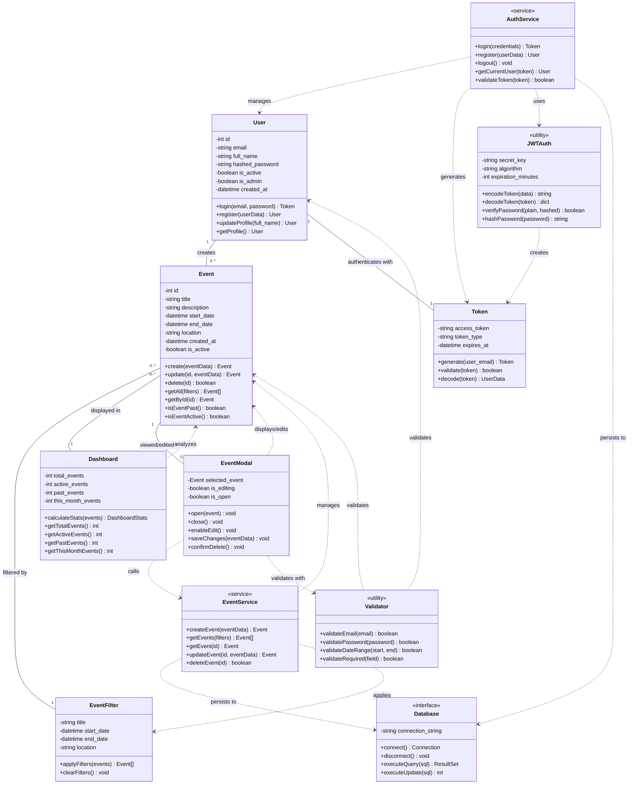

# Diagrama de Classes - Sistema de Gerenciamento de Eventos

## Descrição das Classes

### Classe User (Entidade)
Representa um usuário do sistema, com capacidade de autenticação e gerenciamento de perfil.

**Atributos:**
- `id`: Identificador único do usuário (chave primária)
- `email`: Email único do usuário (usado para login)
- `full_name`: Nome completo do usuário
- `hashed_password`: Senha criptografada usando bcrypt
- `is_active`: Flag indicando se usuário está ativo
- `is_admin`: Flag indicando privilégios administrativos
- `created_at`: Data/hora de criação da conta

**Métodos:**
- `login(email, password)`: Autentica usuário e retorna token JWT
- `register(userData)`: Cria nova conta de usuário
- `updateProfile(full_name)`: Atualiza informações do perfil
- `getProfile()`: Retorna dados do usuário autenticado

**Regras de Negócio:**
- Email deve ser único e válido
- Senha deve ter no mínimo 8 caracteres com maiúscula, minúscula e número
- Senha é sempre armazenada criptografada

---

### Classe Event (Entidade)
Representa um evento cadastrado no sistema.

**Atributos:**
- `id`: Identificador único do evento (chave primária)
- `title`: Título do evento (obrigatório)
- `description`: Descrição detalhada do evento
- `start_date`: Data e hora de início do evento
- `end_date`: Data e hora de término do evento
- `location`: Local onde o evento será realizado
- `created_at`: Data/hora de criação do registro
- `is_active`: Flag indicando se evento está ativo

**Métodos:**
- `create(eventData)`: Cria novo evento
- `update(id, eventData)`: Atualiza evento existente
- `delete(id)`: Remove evento do sistema
- `getAll(filters)`: Retorna lista de eventos com filtros opcionais
- `getById(id)`: Retorna evento específico por ID
- `isEventPast()`: Verifica se evento já passou
- `isEventActive()`: Verifica se evento está ativo (data futura)

**Regras de Negócio:**
- Data de fim deve ser posterior à data de início
- Todos os campos são obrigatórios exceto descrição
- Evento é considerado "passado" se end_date < data atual

---

### Classe Token (Entidade)
Representa um token JWT de autenticação.

**Atributos:**
- `access_token`: String do token JWT
- `token_type`: Tipo do token (sempre "bearer")
- `expires_at`: Data/hora de expiração do token

**Métodos:**
- `generate(user_email)`: Gera novo token para usuário
- `validate(token)`: Valida se token é válido e não expirado
- `decode(token)`: Decodifica token e retorna dados do usuário

---

### Classe EventFilter (Controladora)
Gerencia filtros de busca de eventos.

**Atributos:**
- `title`: Filtro por título (busca parcial)
- `start_date`: Filtro por data inicial
- `end_date`: Filtro por data final
- `location`: Filtro por local (busca parcial)

**Métodos:**
- `applyFilters(events)`: Aplica filtros à lista de eventos
- `clearFilters()`: Limpa todos os filtros aplicados

---

### Classe Dashboard (Controladora)
Calcula e gerencia estatísticas dos eventos.

**Atributos:**
- `total_events`: Total de eventos cadastrados
- `active_events`: Eventos com data futura
- `past_events`: Eventos com data passada
- `this_month_events`: Eventos do mês atual

**Métodos:**
- `calculateStats(events)`: Calcula todas as estatísticas
- `getTotalEvents()`: Retorna total de eventos
- `getActiveEvents()`: Retorna eventos ativos
- `getPastEvents()`: Retorna eventos passados
- `getThisMonthEvents()`: Retorna eventos do mês

---

### Classe EventModal (Boundary)
Controla modal de visualização e edição de eventos.

**Atributos:**
- `selected_event`: Evento atualmente selecionado
- `is_editing`: Flag indicando modo de edição
- `is_open`: Flag indicando se modal está aberto

**Métodos:**
- `open(event)`: Abre modal com evento específico
- `close()`: Fecha modal
- `enableEdit()`: Habilita modo de edição
- `saveChanges(eventData)`: Salva alterações do evento
- `confirmDelete()`: Confirma e executa exclusão

---

### Classe AuthService (Serviço)
Serviço responsável por operações de autenticação.

**Métodos:**
- `login(credentials)`: Processa login e retorna token
- `register(userData)`: Registra novo usuário
- `logout()`: Encerra sessão do usuário
- `getCurrentUser(token)`: Retorna usuário do token
- `validateToken(token)`: Valida token JWT

---

### Classe EventService (Serviço)
Serviço responsável por operações com eventos.

**Métodos:**
- `createEvent(eventData)`: Cria novo evento
- `getEvents(filters)`: Busca eventos com filtros
- `getEvent(id)`: Busca evento por ID
- `updateEvent(id, eventData)`: Atualiza evento
- `deleteEvent(id)`: Exclui evento

---

### Classe Database (Interface)
Interface para operações com banco de dados SQL Server.

**Atributos:**
- `connection_string`: String de conexão com o banco

**Métodos:**
- `connect()`: Estabelece conexão com banco
- `disconnect()`: Fecha conexão
- `executeQuery(sql)`: Executa consulta SELECT
- `executeUpdate(sql)`: Executa INSERT/UPDATE/DELETE

---

### Classe JWTAuth (Utilitário)
Classe utilitária para operações de JWT e criptografia.

**Atributos:**
- `secret_key`: Chave secreta para assinar tokens
- `algorithm`: Algoritmo de criptografia (HS256)
- `expiration_minutes`: Tempo de expiração do token (30 min)

**Métodos:**
- `encodeToken(data)`: Cria token JWT
- `decodeToken(token)`: Decodifica token JWT
- `verifyPassword(plain, hashed)`: Verifica senha
- `hashPassword(password)`: Criptografa senha com bcrypt

---

### Classe Validator (Utilitário)
Classe utilitária para validações.

**Métodos:**
- `validateEmail(email)`: Valida formato de email
- `validatePassword(password)`: Valida força da senha
- `validateDateRange(start, end)`: Valida intervalo de datas
- `validateRequired(field)`: Valida campo obrigatório

---

## Relacionamentos

### Associações
- **User → Event** (1:N): Um usuário pode criar vários eventos
- **User → Token** (1:1): Um usuário possui um token de autenticação ativo
- **Event → EventFilter** (N:1): Múltiplos eventos podem ser filtrados
- **Event → Dashboard** (N:1): Eventos são exibidos no dashboard
- **Event → EventModal** (1:0..1): Um evento pode ser visualizado em modal

### Dependências (uso)
- **AuthService** usa **User**, **Token**, **JWTAuth**, **Database**
- **EventService** usa **Event**, **Database**, **EventFilter**
- **EventModal** usa **Event**, **EventService**, **Validator**
- **Dashboard** analisa **Event**
- **JWTAuth** cria **Token**
- **Validator** valida **User** e **Event**

---

## Padrões Utilizados

1. **MVC (Model-View-Controller)**
   - Model: User, Event, Token
   - View: EventModal, Dashboard (componentes React)
   - Controller: AuthService, EventService

2. **Service Layer Pattern**
   - Lógica de negócio separada em services

3. **Repository Pattern**
   - Database interface abstrai acesso aos dados

4. **Singleton Pattern**
   - Database connection
   - JWTAuth instance

5. **Strategy Pattern**
   - EventFilter aplica diferentes estratégias de filtro
